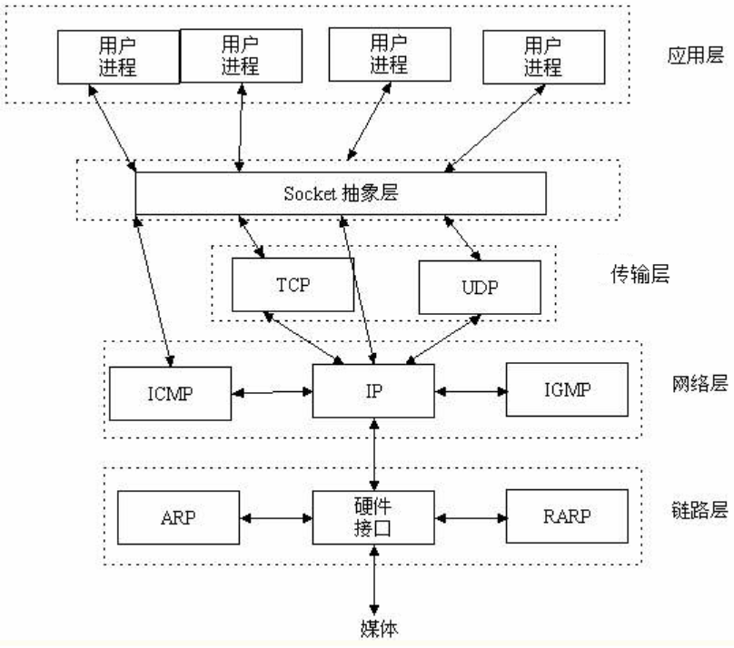

### TCP/UDP协议:  
```
TCP（Transmission Control Protocol）一种面向连接的、可靠的、传输层通信协议(比如:打电话)
优点:可靠，稳定,传输完整稳定,不限制数据大小
缺点:慢，效率低，占用系统资源高，一发一收都需要对方确认
应用：Web浏览器,电子邮件,文件传输,大量数据传输的场景

UDP（User Datagram Protocol）一种无连接的,不可靠的传输层通信协议(比如:发短信)
优点:速度快,可以多人同时聊天,耗费资源少,不需要建立连接
缺点:不稳定,不能保证每次数据都能接收到
应用：IP电话,实时视频会议,聊天软件,少量数据传输的场景

客户端和服务端在建立连接时: 三次握手
客户端和服务端在断开连接时: 四次挥手
SYN 创建连接
ACK 确认响应
FIN 断开连接
```
### 三次握手:


### 四次挥手:
```
MSL为最大报文段生存时间
默认规定MSL为2分钟，但实际应用中常用的是30秒，1分钟和2分钟等。
```

### 整体缩略图


### socket 

```
socket的意义:通络通信过程中,信息拼接的工具(中文:套接字)
```

