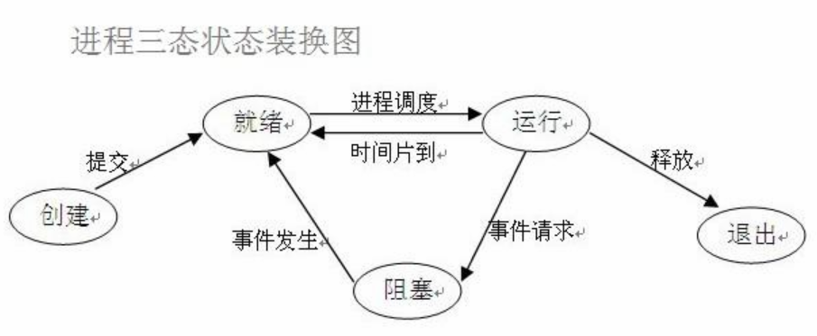

### 进程的概念:(Process)
```
进程就是正在运行的程序,它是操作系统中,资源分配的最小单位.
资源分配:分配的是cpu和内存等物理资源
进程号是进程的唯一标识

同一个程序执行两次之后是两个进程
进程和进程之间的关系: 数据彼此隔离,通过socket通信
```
### 并行和并发
```
并发:一个cpu同一时间不停执行多个程序
并行:多个cpu同一时间不停执行多个程序
```
### cpu的进程调度方法
```
# 先来先服务fcfs(first come first server):先来的先执行
# 短作业优先算法:分配的cpu多,先把短的算完
# 时间片轮转算法:每一个任务就执行一个时间片的时间.然后就执行其他的.
# 多级反馈队列算法

越是时间长的,cpu分配的资源越少,优先级靠后
越是时间短的,cpu分配的资源越多
```
### 进程三状态图


```
(1)就绪(Ready)状态
	只剩下CPU需要执行外,其他所有资源都已分配完毕 称为就绪状态。
(2)执行(Running)状态
	cpu开始执行该进程时称为执行状态。
(3)阻塞(Blocked)状态
	由于等待某个事件发生而无法执行时,便是阻塞状态,cpu执行其他进程.例如，等待I/O完成input、申请缓冲区不能满足等等。	
```


### 同步 异步 / 阻塞 非阻塞
```
场景在多任务当中
同步:必须等我这件事干完了,你在干,只有一条主线,就是同步
异步:没等我这件事情干完,你就在干了,有两条主线,就是异步
阻塞:比如代码有了input,就是阻塞,必须要输入一个字符串,否则代码不往下执行
非阻塞:没有任何等待,正常代码往下执行.
 
# 同步阻塞  :效率低,cpu利用不充分
# 异步阻塞  :比如socketserver,可以同时连接多个,但是彼此都有recv
# 同步非阻塞:没有类似input的代码,从上到下执行.默认的正常情况代码
# 异步非阻塞:效率是最高的,cpu过度充分,过度发热 液冷
```
### 守护进程
```
#可以给子进程贴上守护进程的名字,该进程会随着主进程代码执行完毕而结束(为主进程守护)
(1)守护进程会在主进程代码执行结束后就终止
(2)守护进程内无法再开启子进程,否则抛出异常(了解)
```
### 锁(Lock)
```
lock.acquire()# 上锁
lock.release()# 解锁

#同一时间允许一个进程上一把锁 就是Lock
	加锁可以保证多个进程修改同一块数据时，同一时间只能有一个任务可以进行修改，即串行的修改，没错，速度是慢了，但牺牲速度却保证了数据安全。
#同一时间允许多个进程上多把锁 就是[信号量Semaphore]
	信号量是锁的变形: 实际实现是 计数器 + 锁,同时允许多个进程上锁	

# 互斥锁Lock : 互斥锁就是进程的互相排斥,谁先抢到资源,谁就上锁改资源内容,为了保证数据的同步性
# 注意:多个锁一起上,不开锁,会造成死锁.上锁和解锁是一对.
```
### 事件(Event)
```
# 阻塞事件 ：
	e = Event()生成事件对象e   
	e.wait()动态给程序加阻塞 , 程序当中是否加阻塞完全取决于该对象中的is_set() [默认返回值是False]
    # 如果是True  不加阻塞
    # 如果是False 加阻塞

# 控制这个属性的值
    # set()方法     将这个属性的值改成True
    # clear()方法   将这个属性的值改成False
    # is_set()方法  判断当前的属性是否为True  (默认上来是False)
```
### 进程间通信 IPC
```
# IPC Inter-Process Communication
# 实现进程之间通信的两种机制:
    # 管道 Pipe
    # 队列 Queue
    
# put() 存放
# get() 获取
# get_nowait() 拿不到报异常
# put_nowait() 非阻塞版本的put
q.empty()      检测是否为空  (了解)
q.full() 	   检测是否已经存满 (了解)
```
### 生产者与消费者模型


