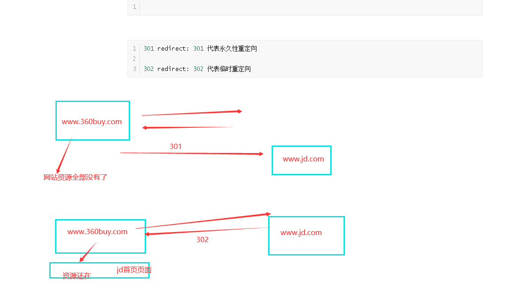
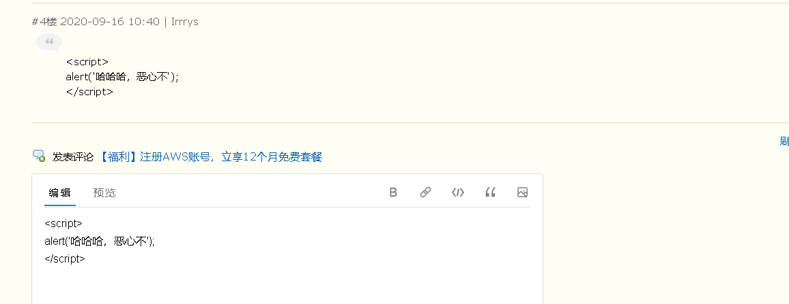

注意:发送post请求时,要先讲settings.py文件中的某个配置注释掉:

```python
MIDDLEWARE = [
    'django.middleware.security.SecurityMiddleware',
    'django.contrib.sessions.middleware.SessionMiddleware',
    'django.middleware.common.CommonMiddleware',
    # 'django.middleware.csrf.CsrfViewMiddleware',
    'django.contrib.auth.middleware.AuthenticationMiddleware',
    'django.contrib.messages.middleware.MessageMiddleware',
    'django.middleware.clickjacking.XFrameOptionsMiddleware',
]
```


urls.py

```python
from django.contrib import admin
# from django.urls import path
from django.conf.urls import url

from app01 import views

urlpatterns = [
    url('^admin/', admin.site.urls),

    # path('login/', views.login),
    # path('login2/', views.login2),

    url('^login3/', views.login3),

]
```

views.py

```python


def login(request):


	return render(request,'login.html')


# post请求提交的数据,通过request.POST来获取
# get或者post,当请求url中含有查询参数时,要在后台的request对象中获取查询参数,用的属性为request.GET
# http://127.0.0.1:8001/login/?a=1&b=2

def login2(request):

	print(request.POST) # <QueryDict: {'username': ['chao'], 'password': ['123']}>

	uname = request.POST.get('username')
	pwd = request.POST.get('password')
	# print(uname, pwd)

	if uname == 'root' and pwd == '123':
		return render(request,'home.html', {'username': uname})

	else:
		return render(request, '404.html')
	# HttpResponse 回复普通字符串
	# render 回复html页面
	# return HttpResponse('ok')


# 合并版
def login3(request):
	print(request.method)  # 获取当前请求的请求方法,大写的

	if request.method == 'GET':
		return render(request, 'login.html')
	else:

		uname = request.POST.get('username')
		pwd = request.POST.get('password')
		# print(uname, pwd)

		if uname == 'root' and pwd == '123':
			return render(request, 'home.html', {'username': uname})

		else:
			return render(request, '404.html')
```


login.html

```html

<form action="/login3/" method="post">  <!-- 提交数据时自动拼接上网址,不带路径 -->

   用户名: <input type="text" name="username">
   密码: <input type="password" name="password">


{#    <input type="submit">#}
    <button>提交</button>
</form>

```


# url

写url时需要注意的点:

```python
1 url(r'^index/', views.index),     路径的前置导航斜杠(对应根路径那个),不需要写,django自动加上
2 http://127.0.0.1:8000/index 当我们访问django的url路径时,如果请求路径最后没有写/,那么django会发一个重定向的响应,告诉浏览器,加上/再来访问我
# settigns.py配置文件中修改:
# APPEND_SLASH = True  # 默认为True, 当值为True时,django需要请求路径后面加上斜杠,如果请求没有加,那么响应301重定向,让浏览器街上斜杠重新请求
# 值为False,就关闭了django的这个功能
# APPEND_SLASH = False        
        
url(r'^index/$', views.index),  #/index/   /index  
url(r'^index/xx/xx/', views.index2),  #/index/   /index
# 注意: 路径写正则时,要注意最好精确匹配,尾部加上$,或者写正则时,尽量不要路径差不多    

url(r'^$', views.home),  #匹配根路径的写法  
```


url分组

```python
无名分组:
    url(r'^books/(\d+)/(\d+)/', views.books) # 无名分组,位置参数,注意参数位置固定
    视图函数写法:
    def books(request, y, m):
	print(y, m)  # 2019  匹配出来的都是字符串

	return HttpResponse('%s-%s所有书籍都在这儿,你随意看' % (y, m))    

有名分组
	url(r'^books/(?P<year>\d+)/(?P<month>\d+)/', views.books2),
    # def books2(request, year):  函数参数必须和有名分组的名称相同
    # def books2(request, year):  而且不在乎参数位置

    def books2(request,  month, year):
        print(year, month)  # 2019  匹配出来的都是字符串

        return HttpResponse('%s--%s所有书籍都在这儿,你随意看' % (year,month ))

```


# 视图部分

request的常用属性

```python
def login(request):
	print(request)  #<WSGIRequest: GET '/login/?a=1&b=2'> WSGIRequest类的实例化对象
	print(request.method)
	print(request.POST)
	print(request.GET)  # request.GET.get('a')  == 1
	print(request.path)  #当前请求路径
	print(request.get_full_path())  #当前请求路径包含查询参数
	print(request.META)  #所有请求头的信息 {''HTTP_USER_AGENT':'asdfasdfasdf',....}
	# 	request.META 字典类型数据,所有的请求头的键都加上了一个HTTP_键名称
	return HttpResponse('ok')
```

response方法

```python

```


```python
301 redirect: 301 代表永久性重定向

302 redirect: 302 代表临时重定向
```





redirect响应

示例:

```python

def login(request):
	print(request)  #<WSGIRequest: GET '/login/?a=1&b=2'> WSGIRequest类的实例化对象
	print(request.method)
	print(request.POST)
	print(request.GET)  # request.GET.get('a')  == 1
	print(request.path)  #当前请求路径
	print(request.get_full_path())  #当前请求路径包含查询参数
	print(request.META)  #所有请求头的信息 {''HTTP_USER_AGENT':'asdfasdfasdf',....}
	# 	request.META 字典类型数据,所有的请求头的键都加上了一个HTTP_键名称
	# return HttpResponse('ok')
	if request.method == 'GET':
		return render(request, 'login.html')

	else:
		uname = request.POST.get('username')
		if uname == 'shiyuan':
			
			return redirect('/home/')  #redirect的参数为一个路径
			# return render(request, 'home.html')  #redirect的参数为一个路径


def home(request):
	book = '金瓶梅'
	return render(request,'home.html' , {'book': book})
```

三个响应方法:

```python
render  响应页面  默认响应状态码为200
HttpResponse 响应字符串  默认响应状态码为200
redirect 重定向  默认响应状态码是302
```


设置响应头和状态码

```python
def index(request):

	re = HttpResponse('xxx')
	# re = render('xxx')
	# ret = redirect('/home/')
	re['name'] = 'gaodaao'  # 添加响应头键值对  #HttpResponse setattr
	re.status_code = 404  # 修改状态码
	
	return re
```


## CBV和FBV

　　**FBV（function base views）** 就是在视图里使用函数处理请求。

　　　　之前都是FBV模式写的代码，所以就不写例子了。

　　**CBV（class base views）** 就是在视图里使用类处理请求。


写视图逻辑的两种方式

urls.py文件的写法

```python

urlpatterns = [
    ...
    url(r'^book/', views.BookView.as_view()),  


]
```

视图部分写法

```python
from django.views import View
class BookView(View):
	# 通过反射获取到请求方法对应的类中的方法来执行
	def get(self,request):
		return HttpResponse('ok')
	# 需要处理什么请求方法,就写对应名称的方法
```

原码部分

```python
def dispatch(self, request, *args, **kwargs):
    # Try to dispatch to the right method; if a method doesn't exist,
    # defer to the error handler. Also defer to the error handler if the
    # request method isn't on the approved list.
    if request.method.lower() in self.http_method_names: #get
        # ['get', 'post', 'put', 'patch', 'delete', 'head', 'options', 'trace']
        handler = getattr(self, request.method.lower(), self.http_method_not_allowed)
    else:
        handler = self.http_method_not_allowed
    return handler(request, *args, **kwargs)  # HttpResponse('ok')
```


CBV模式urls参数

urls.py

```python
url(r'^articles/(\d+)/', views.ArticalView.as_view()),
```


views.py

```python
class ArticalView(View):
	# 和FBV模式相同,有名分组是关键字传参,无名分组是位置传参
	def get(self,request, year): 
		print(year)
		return HttpResponse('articals')
```


dispatch方法的使用和装饰器的使用

```python
from django.utils.decorators import method_decorator

# 方式 3
# @method_decorator(func,name='post')
# @method_decorator(func,name='get')
class ArticalView(View):

	# def get(self,request, year):
	# 	print(year)
	# 	return HttpResponse('articals')
	# 重写dispatch方法来进行拓展
	# @method_decorator(func)  # 方式2
	# def dispatch(self, request, *args, **kwargs):
	#
	# 	print('111111')
	# 	ret = super(ArticalView, self).dispatch(request, *args, **kwargs)
	#
	# 	print('222222')
	# 	return ret

	# @method_decorator(func)  # CBV方法加装饰器的方式1
	def get(self,request, year):
		print(year)
		return render(request, 'articals.html')

	# @method_decorator(func)
	def post(self,request, year):
		print(request.POST)
		return HttpResponse('ok')
```


# 模板渲染

{{变量}}

```python
def index(request):

	name = '赵万里'
	age = 18
	hobby = ['打游戏', '快乐风男', '嫖']
	d1 = {'a':'b', 'c': 'd'}

	class A:
		def __init__(self):
			self.username = '万里'

		def my_hobby(self):
			return '张宇'

	a = A()
	dd = {
		'name': name,
		"age": age,
		"hobby": hobby,
		"d1": d1,
		"a": a,
	}
	# 'asdfasdfasdf{{hobby.0}}' --  hobby[0]
	# 模板渲染完成之后, 才返回给浏览器, 浏览器再进行页面渲染, 生成效果
	return render(request, 'index.html', dd)
```


## 过滤器

在原有数据的基础上进行一些额外的加工处理来使用

```python
语法 无参数过滤的用法{{ 变量|过滤器名称 }}   有参数过滤器用法{{变量|过滤器名称:'参数'}}
示例1: <h2>{{ hobby|length }}</h2>
示例2: <h2>{{ xx|default:'啥也不是' }}</h2>
```


### django自带的过滤器

length

　**返回值的长度，作用于字符串和列表。**

default

​	如果一个变量是false或者为空，使用给定的默认值。 否则，使用变量的值。

filesizeformat

将值格式化为一个 “人类可读的” 文件尺寸 （例如 `'13 KB'`, `'4.1 MB'`, `'102 bytes'`, 等等）。例如：

```
<h3>{{ file_size|filesizeformat }}</h3>
```


### **slice**

切片

```python
ss = 'wanli ai zhangyu'
<h3>{{ ss|slice:'0:5' }}</h3>
```


### **date**

​	格式化,如果 value=datetime.datetime.now()

```python
{{ value|date:"Y-m-d H:i:s"}}
```

### **safe**

xss攻击. 跨站脚本攻击



```python
a_tag = '<a href="http://www.baidu.com">百度<a/>'
<h2>{{ a_tag|safe }}</h2>
```


truncatechars  截断字符

truncatewords 截断单词

```python
<h2>{{ aa|truncatechars:'8' }}</h2> <!-- 截断字符,注意8包含了三个点 -->
 
<h2>{{ aa|truncatewords:'2' }}</h2>  <!-- 以空格做个截断符号,截断单词,2不包含那三个点 -->
```


cut

**移除value中所有的与给出的变量相同的字符串**

```python
<h2>{{ aa|cut:' ' }}</h2>
```


### **join**

字符串拼接

```python
hobby = ['打游戏', '快乐风男', '嫖', 'look']
<h2>{{ hobby|join:'+' }}</h2>
```


