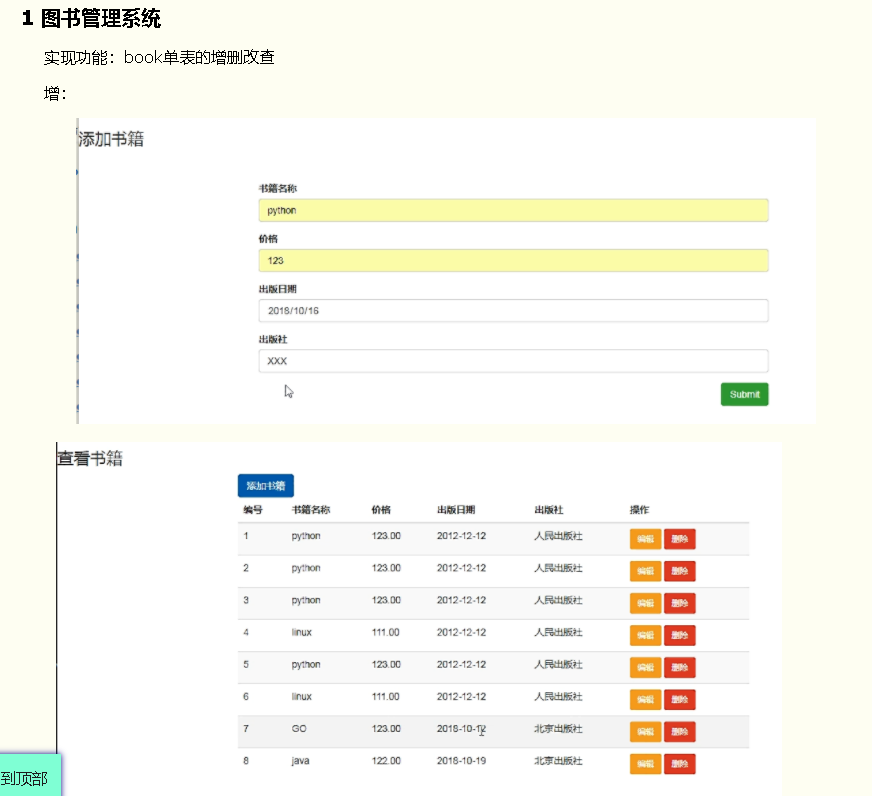

# 模板渲染

## 标签



### for循环标签

```python
<ul>
<!-- 可迭代对象都可以用循环 -->
<!-- 循环列表 -->
    
        <li>{{ foo }}</li>

          <!-- 当循环的数据为空或者没有这个变量时显示empty下面的内容 -->
        <h1>啥也没有</h1>
    

</ul>


<ul>
    <!-- 循环字典 -->
      <!-- 只能获取键 -->
        <li>{{ foo }}</li>
    

      <!-- 获取键值对,items.keys,values都能用 -->
        <li>{{ key }} -- {{ value }}</li>
    


</ul>
```


forloop对象

```python
   
<ul>

    
		forloop  循环标签对象,通过counter属性可以来记录循环次数 
        <li>{{ forloop.counter }}---{{ foo }}</li> 从1开始计数
        <li>{{ forloop.counter0 }}---{{ foo }}</li> 从0开始计数
        <li>{{ forloop.revcounter }}---{{ foo }}</li> 倒序,从1开始计数
        <li>{{ forloop.revcounter0 }}---{{ foo }}</li> 倒序,从0开始计数
        <li>{{ forloop.first }}---{{ foo }}</li> 如果是第一次循环,就得到True 
        <li>{{ forloop.last }}---{{ foo }} </li>  如果是最后一次循环,就得到True,其他为False 


    

</ul>
    
   
    
        forloop.parentloop 统计外层循环对象的循环次数
        
            <li>{{ forloop.parentloop.counter }} -- {{ forloop.counter }} -- {{ v }}</li>
        


    
    
    
reversed 倒序循环
 <ul>

    

        <li>{{ foo }} </li>


    

</ul>
```


### if标签

```html


    <h1>太老了</h1>

    <h1>还行</h1>

    <h1>挺嫩</h1>


 <!-- 符号两边必须有空格 -->
    <h1>太老了</h1>

    <h1>还行</h1>

    <h1>挺嫩</h1>


 <!-- 可以配合过滤器来使用 -->
    <h1>爱好还挺多</h1>

    <h1>爱好不够多</h1>


```

if语句支持 and 、or、==、>、<、!=、<=、>=、in、not in、is、is not判断，注意条件两边都有空格。

注意:

```

...

```


**Django的模板语言中属性的优先级大于方法**

```html
d2 = {'items': [11,22,33]}
优先使用items属性,不使用items方法,容易导致错误

<ul>

    
        <li>{{ key }} -- {{ v }}</li>
    
</ul>
```


### with标签

给调用过程比较长的数据起别名的.

```html
写法1.

    <h1>{{ kk }}</h1>
    
    <h2>{{ kk }}</h2>
    



    <h1>{{ kk }}</h1>
    
    <h2>{{ kk }}</h2>
    

```

### csrf_token标签

```html
<form action="" method="post">
      <!-- 加上这个标签之后,post请求就能通过django的csrf认证机制,就不需要注释settings的配置了 -->
    <input type="text" name="uname">

    <input type="submit">
</form>
```


## 模板继承

先创建一个母版(模板)

比如base.html

```html
<!DOCTYPE html>
<html lang="en">
<head>
    <meta charset="UTF-8">
    <title>Title</title>
    <meta name="viewport" content="width=device-width, initial-scale=1">
    <style>
        .c1{
            background-color: pink;
            height: 40px;

        }
        .left-menu{
            background-color: tan;
            width: 200px;
            min-height: 600px;
        }
        .item{
            background-color: yellow;
            height: 40px;
            border-bottom: 1px solid red;
        }
        .left{
            float: left;
        }
        .right{
            float: left;
        }

    </style>

    

    

</head>
<body>

<div class="nav">
    <div class="c1">
        <a href="">32官网</a>
        <span>性感荷官, 在线发牌</span>

    </div>

</div>

<div class="main">
    <div class="left">
    <div class="left-menu">
        <div class="menu1 item">
            <a href="/t1/">菜单1</a>  <!-- 写相对路径时,前面的斜杠必须写 -->
        </div>
        <div class="menu2 item">
            <a href="/t2/">菜单2</a>
        </div>
        <div class="menu3 item">
            <a href="/t3/">菜单3</a>
        </div>
    </div>
</div>
<div class="right">
    <div class="content">
        
            <h1>基础模板</h1>
        
    </div>
</div>
</div>

</body>



</html>
```


在模板中预留block块(叫做 钩子)

```html

	<h1>基础模板</h1>

```


子页面中继承模板extends

并重写模板中预留的block块中的内容

`{{ block.super }} `显示模板的内容

```html



    <style>
        .c1{
            background-color: green;
            height: 40px;

        }
    </style>




    <h1>性感美女,在线指导</h1>
    {{ block.super }} <!-- 显示模板的内容 -->

```


block块的写法

```html

...



...
　　  可以指定endblock的名称,起到一个提示作用
```


### 组件

一个完整功能的模块,其他页面如果想使用,就直接以组件的形式引入

比如创建一个zujian.htmlm,内容如下

```
<!DOCTYPE html>
<html lang="en">
<head>
    <meta charset="UTF-8">
    <title>Title</title>
    <meta name="viewport" content="width=device-width, initial-scale=1">
    <style>
        .c1{
            background-color: pink;
            height: 40px;

        }
    </style>
</head>
<body>


<div class="nav">
    <div class="c1">
        <a href="">32官网</a>
        <span>性感荷官, 在线发牌</span>

    </div>

</div>
</body>
</html>
```

在home.html中引入一下include

在页面什么位置引入,组件效果就生成到什么位置

```html

<!DOCTYPE html>
<html lang="en">
<head>
    <meta charset="UTF-8">
    <title>Title</title>
    <meta name="viewport" content="width=device-width, initial-scale=1">
</head>
<body>
<h1>这是home页面</h1>



</body>
</html>
```


静态文件的配置流程

1 在settings.py文件中加上如下配置

```python
STATIC_URL = '/static/'  #别名,映射到STATICFILES_DIRS配置的静态文件存放路径,
#那么引入静态文件时,我们使用别名路径来写,如果使用别名路径, 那么修改静态文件夹名称之后,也不会影响静态文件的返回
# STATIC_URL = '/abc/'  别名可以修改的

STATICFILES_DIRS = [
    os.path.join(BASE_DIR, 'statics'),
]

```


2 在项目根目录下创建一个文件夹,名称随意,比如叫做statics


3 在html文件中引入

两种方式

方式1

```html
<!DOCTYPE html>
<html lang="en">
<head>
    <meta charset="UTF-8">
    <title>Title</title>
    <meta name="viewport" content="width=device-width, initial-scale=1">
    <link rel="stylesheet" href="/static/css/xx.css"> 方式1   直接写别名路径开头

</head>
<body>

<div class="c1">xxx</div>


</body>
</html>
```

方式2

```html
   先load一下static
<!DOCTYPE html>
<html lang="en">
<head>
    <meta charset="UTF-8">
    <title>Title</title>
    <meta name="viewport" content="width=device-width, initial-scale=1">

    <link rel="stylesheet" href="" > 方式2


</head>
<body>

<div class="c1">xxx</div>


</body>
</html>
```


自定义过滤器

1 在应用文件夹中创建一个叫做templatetags的文件夹(注意,名称必须是它)

2 在templatetags文件夹中创建一个py文件,名称随意,比如叫做mytag.py

3 在mytag.py文件中写如下内容

```python
from django import template

register = template.Library()  #注册器,变量名称必须叫register

@register.filter   #过滤器
def xx(v1):  #第一参数是使用过滤器时,管道符前面的数据 <h1>{{ name|xx }}</h1>

	return v1 + 'xx'

@register.filter   #过滤器,至多有两个参数
def xx2(v1, v2):  #第一参数是使用过滤器时,管道符前面的数据 ,第二个参数是冒号后面的值,<h1>{{ name|xx:'oo' }}</h1>

	return v1 + 'xx2' + v2

```

4 在html文件中使用

```html
   先load一下我们的mytagpy文件
<!DOCTYPE html>
<html lang="en">
<head>
    <meta charset="UTF-8">
    <title>Title</title>
    <meta name="viewport" content="width=device-width, initial-scale=1">

</head>
<body>
<h1>这是home页面</h1>
{##}

<h1>{{ name|xx }}</h1>   #以过滤器的形式使用,这个是一个参数的
<h1>{{ name|xx2:'oo' }}</h1> # 以过滤器的形式使用,这个是两个参数的


</body>
</html>
```


自定义标签

1 在应用文件夹中创建一个叫做templatetags的文件夹(注意,名称必须是它)

2 在templatetags文件夹中创建一个py文件,名称随意,比如叫做mytag.py

3 在mytag.py文件中写如下内容

```pythom
from django import template

register = template.Library()  #注册器,变量名称必须叫register


@register.simple_tag
def tag1(v1, v2 ,v3):  #参数个数没有限制

	return v1 + v2 + v3
```


4 在html文件中使用

```html

<!DOCTYPE html>
<html lang="en">
<head>
    <meta charset="UTF-8">
    <title>Title</title>
    <meta name="viewport" content="width=device-width, initial-scale=1">

</head>
<body>


<h1></h1>  <!-- 先写标签名称,然后写参数,参数以空格分隔 ,最终得到的tag1的return值 -->

</body>
</html>
```


inclusion_tag 自定义标签

1 在应用文件夹中创建一个叫做templatetags的文件夹(注意,名称必须是它)

2 在templatetags文件夹中创建一个py文件,名称随意,比如叫做mytag.py

3 在mytag.py文件中写如下内容

```python
from django import template

register = template.Library()  #注册器,变量名称必须叫register

# 通过inclusion_tag来做为装饰器,并且需要传入一个参数,这个参数就是一个html文件(你想做成动态组件的html文件)
@register.inclusion_tag('zujian2.html')
def dongtai(v1):  #参数没有个数限制
	data = v1  #[11,22,33,44,55,66]
	return {'xx': data }

# zujian2.html会收到定义的inclusion_tag函数的返回值,然后进行zujian2.html这个动态组件的模板渲染
```


zujian2.html

```html
<!DOCTYPE html>
<html lang="en">
<head>
    <meta charset="UTF-8">
    <title>Title</title>
    <meta name="viewport" content="width=device-width, initial-scale=1">
    <style>
        .left-menu {
            background-color: tan;
            width: 200px;
            min-height: 600px;
        }

        .item {
            background-color: yellow;
            height: 40px;
            border-bottom: 1px solid red;
        }

        .left {
            float: left;
        }
    </style>
</head>
<body>

<div class="left">
        <div class="left-menu">
              <!-- [11,22,33] ,注意 data这是inclusion_tag函数的返回值那个字典中的键 -->
                <div class="menu1 item">
                    <a href="/t1/">{{ item }}</a>  <!-- 写相对路径时,前面的斜杠必须写 -->
                </div>
            
            

        </div>
    </div>


</body>
</html>
```


4 使用inclusion_tag

basic.html

```
   先load
<!DOCTYPE html>
<html lang="en">
<head>
    <meta charset="UTF-8">
    <title>Title</title>
    <meta name="viewport" content="width=device-width, initial-scale=1">
</head>
<body>

  #最终将渲染好的动态组件(zujian2.html),通过include引入组件的方式,加载到这里

</body>
</html>
```

5 在后台视图中渲染basic.html页面是可以传入动态数据

```python

def basic(request):

	# if user.type == 'admin':

	# menu_list = [11,22,33,44,55,66]
	# else:
	menu_list = [22,33]

	return render(request, 'basic.html',{'menu_list': menu_list})
```


作业

要页面效果




